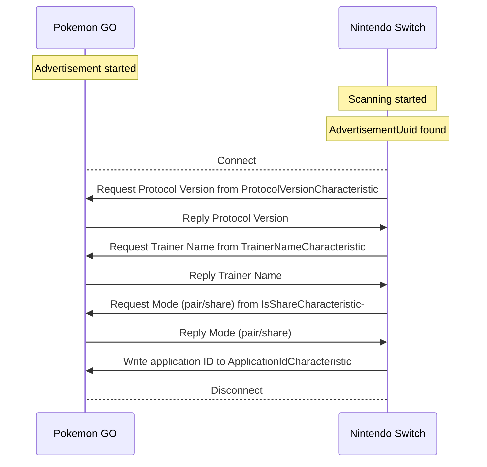
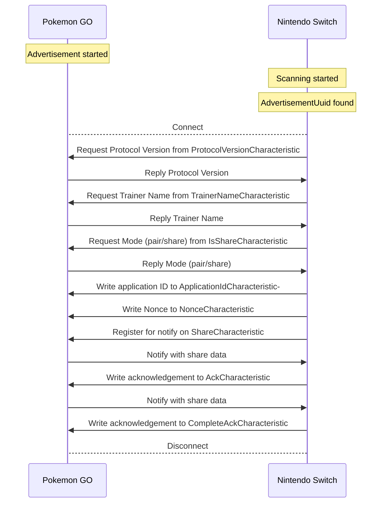

# Communication between Pokemon GO and Nintendo Switch in the Pokemon Violet Switch Game

## Background
Recently you're able to get a specific mon in Pokemon Go when you send a postcard to the Pokemon Violet game on the Nintendo Switch from Pokemon Go. This comminucation happens over Bluetooth Low Energy (BLE) where Pokemon Go is the Peripheral and the Nintendo Switch is the Central.

This repository is here to document my reverse enegeering efforts and understand the protocol being used.

## Information observed

It seems like the codename for this specific project between PoGo and NX is called "Saturday". The Pokemon Violet game seems to be codename "Titan".

It seems that the Switch generates a Nonce with 16 byte lenght but the value is transported in hex instead of bytes (or the Nonce is generated from only printable characters). A nonce cannot be reused. Pokemon GO will reject the connection if it receives a Nonce used before. Unclear if this is for the lifecycle of the application or the value is actually stored somewhere? 

Changes in mac address and trainer name do not seem to affect the encryption. The share data encryption does change when the Application ID and/or Nonce changes.

# Bluetooh Low Energy Services & Characteristics
Pokemon GO is considered the Peripheral and the Ninendo Switch is the Central.

When Pokemon GO initiates the sharing or pairing process it will start advertising a specific service with UUID `b6c3089a-7e4f-487d-b9f8-73a281dd718f`. This is known as the `kAdvertisement`. This UUID seems to be only used for advertisement and you will not be able to get a reference to this service in your Central.

After you've discovered `kAdvertisement` you can connect to the device and service that contains all the characteristics used. This one is called `kSaturdayConnectionService` with UUID `abfaf4c7-5a44-445a-a007-ad19fcb29e99`.

The following characteristics are observed in `kSaturdayConnectionService`:
| Characteristic Name                             | UUID                                    | Description                                                                                   |
|-------------------------------------------|-----------------------------------------|-----------------------------------------------------------------------------------------------|
| kProtocolVersionCharacteristic        | 291e0889-cb21-4add-a587-3bb494ca2acf    | Protocol version. Only 1 observed.                                                        |
| kTrainerNameCharacteristic            | 95c33c9a-9b76-4194-8e41-3b66aa8bb021    | The name of the Pokemon GO Trainer.                                                           |
| kIsShareCharacteristic              | 8f860fd8-51e4-497d-afed-94253dbe2e0a    | Share status. 0 == Pairing, 1 == Sharing of data.                                             |
| kApplicationIdCharacteristic         | 28fdc6ec-b073-4e4a-bf7e-91af16c3e890    | Application ID. Looks like the application ID from the Switch game. The value contains `+titan` to indicate this is Pokemon Violet.                         |
| kNonceCharacteristic                | 2f8b06c2-0e80-45e5-a0dd-ad34c9f7ceb0    | Nonce sent by the Switch.                                                               |
| kShareCharacteristic                | 000dd3aa-d916-4bc7-8a08-ae1a8a008e8a    | Share data received from PoGo. This has the kNonce included.                                  |
| kAckCharacteristic                  | c5b318da-89e6-481f-98e4-b4e0a4203487    | Acknowledgement from Switch to PoGo that the share was received.                               |
| kShareCompleteCharacteristic         | e35da264-384e-4db3-ae27-a1ba2b1f533d    | Unused. While the Switch tries to read this Char, PoGo only sends an error back saying that the Char does not exist (bug?). |
| kCompleteAckCharacteristic           | 6324802e-5266-4f4a-95be-3a8f811874fc    | Switch seems to send this, PoGo only uses it to internally mark the share as completed. The value seems to be the nonce but the value is not used. |


# Comminucation flow
Before you can share a postcard with the switch game you need to pair.
## Pairing

## Sharing


# Current unknowns
## Share data
Currently it's unknown to me what's actually inside the sharing information. The information inside the share is currently unknown to me.

A sample transaction can be seen here:
```
13:13:44.492 -> Forming a connection to 6b:c5:a7:b4:03:7d
13:13:44.492 ->  - Created Nintendo Switch client
13:13:44.845 ->  - Connected to Pokemon GO
13:13:45.614 -> Pokemon GO Protocol version: 1
13:13:45.678 -> Pokemon GO Trainer name: <redacted>
13:13:45.710 -> Pokemon GO Mode: sharing
13:13:45.710 -> Written kApplicationId to Pokemon GO.
13:13:45.710 -> Written kNonce to Pokemon GO.
13:13:45.742 -> Subscribed to kShareCharacteristic
13:13:46.320 -> Received Postcard from Pokemon GO.
13:13:46.320 -> 0000: 0a 47 08 08 10 e9 f8 ab 88 f2 30 1a 2a 38 36 66   .G........0.*86f
13:13:46.320 -> 0010: 31 31 38 63 62 2d 33 37 31 37 2d 35 32 32 31 2d   118cb-3717-5221-
13:13:46.352 -> 0020: 39 38 62 37 2d 36 62 62 38 35 36 63 66 32 33 33   98b7-6bb856cf233
13:13:46.352 -> 0030: 65 2b 74 69 74 61 6e 22 10 62 37 30 35 36 37 37   e+titan".b705677
13:13:46.352 -> 0040: 62 35 38 62 31 37 64 39 65 12 80 02 9e a3 89 6a   b58b17d9e......j
13:13:46.352 -> 0050: 9a 4e 68 ae ba 47 06 e0 c0 26 19 87 99 71 80 51   .Nh..G...&...q.Q
13:13:46.352 -> 0060: 11 31 92 63 16 44 88 50 7c 51 a0 b2 db 52 e8 43   .1.c.D.P|Q...R.C
13:13:46.416 -> 0070: cb 01 58 b7 ef 01 d6 88 b6 d9 61 18 99 52 0f e9   ..X.......a..R..
13:13:46.416 -> 0080: 2d f7 6c bd f6 77 67 db 15 cf 6c f4 5e 2a b1 e2   -.l..wg...l.^*..
13:13:46.416 -> 0090: 15 d2 a6 d4 e2 b3 d8 3f 85 a5 a6 7f 45 a0 6e f1   .......?....E.n.
13:13:46.416 -> 00a0: df 48 26 44 bb 18 c4 46 ae 92 2a b0 a0 29 95 b0   .H&D...F..*..)..
13:13:46.416 -> 00b0: 6b 50 09 a3 b9 77 b3 52 35 e7 43 cb 8b de f4 ac   kP...w.R5.C.....
13:13:46.422 -> 00c0: 95 60 42 c4 9a 33 dc 06 6c df f0 42 a6 eb 88 f1   .`B..3..l..B....
13:13:46.422 -> 00d0: aa 79 c1 9c 0f a3 9f f6 62 7c 77 63 80 d9 24 86   .y......b|wc..$.
13:13:46.422 -> 00e0: b8 ff 82 7b 98 91 f7 87 fb 9e d1 b8 2e d1 5a 0f   ...{..........Z.
13:13:46.422 -> 00f0: 87 88 d0 78 e8 62 5f 62 7b d4 94 48 4f 00 d0 31   ...x.b_b{..HO..1
13:13:46.422 -> 0100: 62 fa 00 d4 bc ef 9a 8c 3c 18 8e 6c 97 0e 13 ca   b.......<..l....
13:13:46.448 -> 0110: de d1 fe f6 a9 3d 15 ef 4e 6f 23 bb d0 33 00 d8   .....=..No#..3..
13:13:46.448 -> 0120: 93 8b 58 a7 99 e9 a8 c1 ac 2f 3a b8 de 52 29 43   ..X....../:..R)C
13:13:46.448 -> 0130: d2 81 38 1a 57 36 43 f5 25 4d d0 fc 5b f5 dc 8b   ..8.W6C.%M..[...
13:13:46.448 -> 0140: c7 9f eb a5 76 a9 66 ae 2d 7a bb 95               ....v.f.-z..
13:13:46.448 -> Written (invalid) kAck to Pokemon GO.
```
The Application ID `86f118cb-3717-5221-98b7-6bb856cf233e+titan` and nonce `b705677b58b17d9e` can  be seen in this packet. The information after the nonce seems toe encrypted.

## Important observation!!
When you send the same share (=Postcard) from Pokemon GO with the same nonce (you have to restart the app for that, because normally it would not accept the nonce again after a failed transaction) the shate data is exactly the same. This means that there seems not to be a dynamic aspect to it.
```
14:10:38.377 -> 0000: 0a 47 08 08 10 d6 ad a8 b2 f3 30 1a 2a 38 36 66   .G........0.*86f
14:10:38.377 -> 0010: 31 31 38 63 62 2d 33 37 31 37 2d 35 32 32 31 2d   118cb-3717-5221-
14:10:38.409 -> 0020: 39 38 62 37 2d 36 62 62 38 35 36 63 66 32 33 33   98b7-6bb856cf233
14:10:38.409 -> 0030: 65 2b 74 69 74 61 6e 22 10 4e 4f 4e 43 45 6e 6f   e+titan".NONCEno
14:10:38.409 -> 0040: 6e 63 65 4e 4f 4e 43 45 31 12 80 02 33 41 f4 3a   nceNONCE1...3A.:
14:10:38.409 -> 0050: 3e 5e a2 92 4c 58 3d b1 a1 26 f2 14 f8 11 ac 0f   >^..LX=..&......
14:10:38.409 -> 0060: 97 2b 1a e2 ba ed b2 65 87 b6 54 07 99 a9 46 d6   .+.....e..T...F.
14:10:38.441 -> 0070: e9 9a f8 83 3e 2b 25 a3 c3 7e fd 88 f0 69 66 9b   ....>+%..~...if.
14:10:38.441 -> 0080: 4e 0b ac 65 07 9c 69 50 09 4a 6a de d2 a2 88 d5   N..e..iP.Jj.....
14:10:38.441 -> 0090: 9b fb 3c dc 50 8a db 58 e0 e7 b1 04 90 b4 bc fc   ..<.P..X........
14:10:38.441 -> 00a0: 10 66 14 b7 86 a9 ba 33 95 86 22 40 cf dc f2 2b   .f.....3.."@...+
14:10:38.441 -> 00b0: 94 67 f7 8d cb 1d 68 97 82 22 59 db d2 58 1c 40   .g....h.."Y..X.@
14:10:38.473 -> 00c0: 00 f6 5e 9b 05 eb 9e 64 ea 4f 5b 36 c5 7f 0f 09   ..^....d.O[6....
14:10:38.473 -> 00d0: a6 46 89 90 7e eb c9 24 96 7d 58 30 eb 74 0b 70   .F..~..$.}X0.t.p
14:10:38.473 -> 00e0: c5 e9 ee 89 db 22 91 b7 a2 cf 64 cc 33 79 66 a4   ....."....d.3yf.
14:10:38.473 -> 00f0: 21 eb 1b f7 b9 3b 0d 1d cf 60 28 f7 cb d1 a2 ec   !....;...`(.....
14:10:38.473 -> 0100: e3 44 1e 1d b3 53 a5 f1 37 b9 38 6d 37 a1 10 8f   .D...S..7.8m7...
14:10:38.505 -> 0110: a1 40 88 c1 fe 4f 01 f9 5d c4 04 a4 9f e4 eb 41   .@...O..]......A
14:10:38.505 -> 0120: 87 5c d8 b7 81 0f b6 9c 8d 32 b4 c7 51 e3 1c 0a   .\.......2..Q...
14:10:38.505 -> 0130: c9 34 aa 46 de 98 67 fb 83 6a cb ec 6c f1 9c 54   .4.F..g..j..l..T
14:10:38.505 -> 0140: 13 f6 9b 48 49 84 c8 f9 4c ef cc 59               ...HI...L..Y
```
```
14:13:08.580 -> 0000: 0a 47 08 08 10 d6 ad a8 b2 f3 30 1a 2a 38 36 66   .G........0.*86f
14:13:08.580 -> 0010: 31 31 38 63 62 2d 33 37 31 37 2d 35 32 32 31 2d   118cb-3717-5221-
14:13:08.580 -> 0020: 39 38 62 37 2d 36 62 62 38 35 36 63 66 32 33 33   98b7-6bb856cf233
14:13:08.612 -> 0030: 65 2b 74 69 74 61 6e 22 10 4e 4f 4e 43 45 6e 6f   e+titan".NONCEno
14:13:08.612 -> 0040: 6e 63 65 4e 4f 4e 43 45 31 12 80 02 33 41 f4 3a   nceNONCE1...3A.:
14:13:08.612 -> 0050: 3e 5e a2 92 4c 58 3d b1 a1 26 f2 14 f8 11 ac 0f   >^..LX=..&......
14:13:08.612 -> 0060: 97 2b 1a e2 ba ed b2 65 87 b6 54 07 99 a9 46 d6   .+.....e..T...F.
14:13:08.612 -> 0070: e9 9a f8 83 3e 2b 25 a3 c3 7e fd 88 f0 69 66 9b   ....>+%..~...if.
14:13:08.644 -> 0080: 4e 0b ac 65 07 9c 69 50 09 4a 6a de d2 a2 88 d5   N..e..iP.Jj.....
14:13:08.644 -> 0090: 9b fb 3c dc 50 8a db 58 e0 e7 b1 04 90 b4 bc fc   ..<.P..X........
14:13:08.644 -> 00a0: 10 66 14 b7 86 a9 ba 33 95 86 22 40 cf dc f2 2b   .f.....3.."@...+
14:13:08.644 -> 00b0: 94 67 f7 8d cb 1d 68 97 82 22 59 db d2 58 1c 40   .g....h.."Y..X.@
14:13:08.644 -> 00c0: 00 f6 5e 9b 05 eb 9e 64 ea 4f 5b 36 c5 7f 0f 09   ..^....d.O[6....
14:13:08.676 -> 00d0: a6 46 89 90 7e eb c9 24 96 7d 58 30 eb 74 0b 70   .F..~..$.}X0.t.p
14:13:08.676 -> 00e0: c5 e9 ee 89 db 22 91 b7 a2 cf 64 cc 33 79 66 a4   ....."....d.3yf.
14:13:08.676 -> 00f0: 21 eb 1b f7 b9 3b 0d 1d cf 60 28 f7 cb d1 a2 ec   !....;...`(.....
14:13:08.676 -> 0100: e3 44 1e 1d b3 53 a5 f1 37 b9 38 6d 37 a1 10 8f   .D...S..7.8m7...
14:13:08.676 -> 0110: a1 40 88 c1 fe 4f 01 f9 5d c4 04 a4 9f e4 eb 41   .@...O..]......A
14:13:08.708 -> 0120: 87 5c d8 b7 81 0f b6 9c 8d 32 b4 c7 51 e3 1c 0a   .\.......2..Q...
14:13:08.708 -> 0130: c9 34 aa 46 de 98 67 fb 83 6a cb ec 6c f1 9c 54   .4.F..g..j..l..T
14:13:08.708 -> 0140: 13 f6 9b 48 49 84 c8 f9 4c ef cc 59               ...HI...L..Y
```
# **For some reason if a nonce is used for a share (=Postcard) it cannot be reused for a different share it seems. It will immedialty fail with "Your Postcard failed to send". This happens directly after the Nonce has been sent. Based on this it seems not possible to use a static nonce.**

Different postcard with different nonce:
```
14:22:43.256 -> 0000: 0a 47 08 08 10 ac cd d4 b2 f3 30 1a 2a 38 36 66   .G........0.*86f
14:22:43.256 -> 0010: 31 31 38 63 62 2d 33 37 31 37 2d 35 32 32 31 2d   118cb-3717-5221-
14:22:43.288 -> 0020: 39 38 62 37 2d 36 62 62 38 35 36 63 66 32 33 33   98b7-6bb856cf233
14:22:43.288 -> 0030: 65 2b 74 69 74 61 6e 22 10 4e 4f 4e 43 45 6e 6f   e+titan".NONCEno
14:22:43.288 -> 0040: 6e 63 65 4e 4f 4e 43 45 32 12 80 02 28 93 bd bc   nceNONCE2...(...
14:22:43.288 -> 0050: 48 14 b4 e5 b1 b1 ee 0c 7e 49 b6 30 39 e9 a0 8c   H.......~I.09...
14:22:43.288 -> 0060: ae 1d a3 3c 4d 9f c2 5d 0e e2 9e 8c 3f 63 c5 04   ...<M..]....?c..
14:22:43.320 -> 0070: 15 6b 9f 0f 3f 09 49 fb 19 09 7c da 18 d3 28 c1   .k..?.I...|...(.
14:22:43.320 -> 0080: cf b3 0d 97 f9 81 11 3e d1 30 a9 bd f3 8f b3 a3   .......>.0......
14:22:43.320 -> 0090: c1 b4 5b 40 b2 8c a5 3d 6c 73 9d 77 d8 57 42 1d   ..[@...=ls.w.WB.
14:22:43.320 -> 00a0: 48 51 6f a1 f6 2d 70 3a 61 38 10 da ad ac f3 ae   HQo..-p:a8......
14:22:43.320 -> 00b0: a8 5d 50 79 44 05 65 7b e7 42 14 60 fa 20 45 05   .]PyD.e{.B.`. E.
14:22:43.352 -> 00c0: f4 86 c0 a6 f9 ab 73 53 5c ad 88 72 71 05 85 76   ......sS\..rq..v
14:22:43.352 -> 00d0: b8 6f 00 85 29 cc 54 20 f6 49 df e6 57 89 e6 5b   .o..).T .I..W..[
14:22:43.352 -> 00e0: 67 7d a8 1b 53 c7 90 6a f0 bb 80 60 e4 97 81 ea   g}..S..j...`....
14:22:43.352 -> 00f0: ff d2 dd 4a 43 12 4b 0f e5 2c e0 5b e8 a7 6e 57   ...JC.K..,.[..nW
14:22:43.352 -> 0100: 03 43 57 b4 38 d4 b5 2e cd 21 2e d3 fa 52 3a d4   .CW.8....!...R:.
14:22:43.384 -> 0110: 1f 5b 11 f6 89 7b f8 b1 bb 73 32 54 90 38 9b 47   .[...{...s2T.8.G
14:22:43.384 -> 0120: 2e ac 0e 4d 2f 67 14 d4 12 e4 b0 a5 67 1f 52 5d   ...M/g......g.R]
14:22:43.384 -> 0130: ba db ee 54 97 c9 76 59 fc b6 fa 15 a9 0b a6 7a   ...T..vY.......z
14:22:43.384 -> 0140: b2 ed 2e 39 aa 92 b6 e3 d4 9f 24 b4               ...9......$.
```
```
14:26:02.010 -> 0000: 0a 47 08 08 10 ac cd d4 b2 f3 30 1a 2a 38 36 66   .G........0.*86f
14:26:02.010 -> 0010: 31 31 38 63 62 2d 33 37 31 37 2d 35 32 32 31 2d   118cb-3717-5221-
14:26:02.010 -> 0020: 39 38 62 37 2d 36 62 62 38 35 36 63 66 32 33 33   98b7-6bb856cf233
14:26:02.010 -> 0030: 65 2b 74 69 74 61 6e 22 10 4e 4f 4e 43 45 6e 6f   e+titan".NONCEno
14:26:02.042 -> 0040: 6e 63 65 4e 4f 4e 43 45 32 12 80 02 28 93 bd bc   nceNONCE2...(...
14:26:02.042 -> 0050: 48 14 b4 e5 b1 b1 ee 0c 7e 49 b6 30 39 e9 a0 8c   H.......~I.09...
14:26:02.042 -> 0060: ae 1d a3 3c 4d 9f c2 5d 0e e2 9e 8c 3f 63 c5 04   ...<M..]....?c..
14:26:02.042 -> 0070: 15 6b 9f 0f 3f 09 49 fb 19 09 7c da 18 d3 28 c1   .k..?.I...|...(.
14:26:02.042 -> 0080: cf b3 0d 97 f9 81 11 3e d1 30 a9 bd f3 8f b3 a3   .......>.0......
14:26:02.074 -> 0090: c1 b4 5b 40 b2 8c a5 3d 6c 73 9d 77 d8 57 42 1d   ..[@...=ls.w.WB.
14:26:02.074 -> 00a0: 48 51 6f a1 f6 2d 70 3a 61 38 10 da ad ac f3 ae   HQo..-p:a8......
14:26:02.074 -> 00b0: a8 5d 50 79 44 05 65 7b e7 42 14 60 fa 20 45 05   .]PyD.e{.B.`. E.
14:26:02.074 -> 00c0: f4 86 c0 a6 f9 ab 73 53 5c ad 88 72 71 05 85 76   ......sS\..rq..v
14:26:02.074 -> 00d0: b8 6f 00 85 29 cc 54 20 f6 49 df e6 57 89 e6 5b   .o..).T .I..W..[
14:26:02.106 -> 00e0: 67 7d a8 1b 53 c7 90 6a f0 bb 80 60 e4 97 81 ea   g}..S..j...`....
14:26:02.106 -> 00f0: ff d2 dd 4a 43 12 4b 0f e5 2c e0 5b e8 a7 6e 57   ...JC.K..,.[..nW
14:26:02.106 -> 0100: 03 43 57 b4 38 d4 b5 2e cd 21 2e d3 fa 52 3a d4   .CW.8....!...R:.
14:26:02.106 -> 0110: 1f 5b 11 f6 89 7b f8 b1 bb 73 32 54 90 38 9b 47   .[...{...s2T.8.G
14:26:02.106 -> 0120: 2e ac 0e 4d 2f 67 14 d4 12 e4 b0 a5 67 1f 52 5d   ...M/g......g.R]
14:26:02.138 -> 0130: ba db ee 54 97 c9 76 59 fc b6 fa 15 a9 0b a6 7a   ...T..vY.......z
14:26:02.138 -> 0140: b2 ed 2e 39 aa 92 b6 e3 d4 9f 24 b4               ...9......$.
```
